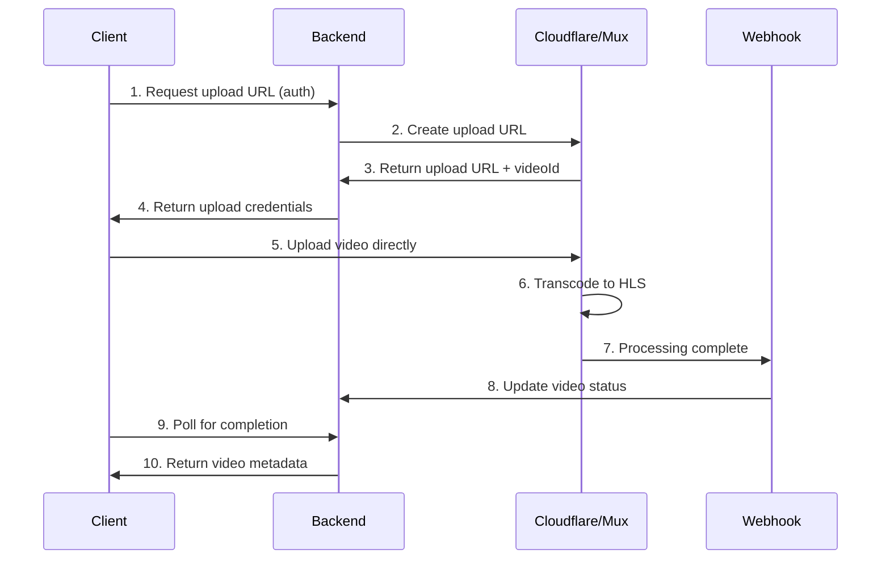

# Video Upload Flow API Implementation

## 🔄 **Complete Upload & Processing Flow**

### **Flow Overview**


---

## 📡 **API Endpoints**

### **1. Request Upload URL**
```typescript
// POST /api/videos/upload-url
export async function POST(request: NextRequest) {
  try {
    const { filename, fileSize, mimeType, metadata } = await request.json();
    
    // Validate authentication
    const token = request.headers.get('authorization')?.replace('Bearer ', '');
    const user = await validateAuthToken(token);
    
    if (!user) {
      return NextResponse.json({ error: 'Unauthorized' }, { status: 401 });
    }
    
    // Validate file
    if (fileSize > 500 * 1024 * 1024) { // 500MB limit
      return NextResponse.json({ error: 'File too large' }, { status: 400 });
    }
    
    if (!mimeType.startsWith('video/')) {
      return NextResponse.json({ error: 'Invalid file type' }, { status: 400 });
    }
    
    // Get video service
    const videoService = getVideoService();
    
    // Create upload URL based on provider
    const uploadData = await createUploadUrl(videoService, {
      filename,
      fileSize,
      mimeType,
      userId: user.id,
      metadata
    });
    
    // Store pending upload in database
    await db.videoUploads.create({
      data: {
        id: uploadData.videoId,
        userId: user.id,
        filename,
        fileSize,
        mimeType,
        status: 'uploading',
        provider: uploadData.provider,
        uploadUrl: uploadData.uploadUrl,
        metadata,
        createdAt: new Date(),
      }
    });
    
    return NextResponse.json(uploadData);
    
  } catch (error) {
    console.error('Upload URL creation failed:', error);
    return NextResponse.json(
      { error: 'Failed to create upload URL' },
      { status: 500 }
    );
  }
}

async function createUploadUrl(videoService: any, params: any) {
  const provider = process.env.VIDEO_PROVIDER || 'cloudflare';
  
  if (provider === 'cloudflare') {
    return createCloudflareUploadUrl(params);
  } else if (provider === 'mux') {
    return createMuxUploadUrl(params);
  } else {
    throw new Error('Unsupported video provider');
  }
}

async function createCloudflareUploadUrl(params: any) {
  const response = await fetch(
    `https://api.cloudflare.com/client/v4/accounts/${process.env.CLOUDFLARE_ACCOUNT_ID}/stream/direct_upload`,
    {
      method: 'POST',
      headers: {
        'Authorization': `Bearer ${process.env.CLOUDFLARE_API_TOKEN}`,
        'Content-Type': 'application/json',
      },
      body: JSON.stringify({
        maxDurationSeconds: 3600, // 1 hour max
        expiry: new Date(Date.now() + 6 * 60 * 60 * 1000).toISOString(), // 6 hours
        meta: {
          userId: params.userId,
          filename: params.filename,
          ...params.metadata
        },
        requireSignedURLs: false, // Set to true for private videos
      }),
    }
  );
  
  if (!response.ok) {
    throw new Error('Failed to create Cloudflare upload URL');
  }
  
  const data = await response.json();
  
  return {
    videoId: data.result.uid,
    uploadUrl: data.result.uploadURL,
    provider: 'cloudflare',
    expiresAt: data.result.expiry,
  };
}

async function createMuxUploadUrl(params: any) {
  const response = await fetch('https://api.mux.com/video/v1/uploads', {
    method: 'POST',
    headers: {
      'Authorization': `Basic ${Buffer.from(
        `${process.env.MUX_TOKEN_ID}:${process.env.MUX_TOKEN_SECRET}`
      ).toString('base64')}`,
      'Content-Type': 'application/json',
    },
    body: JSON.stringify({
      cors_origin: process.env.NEXT_PUBLIC_APP_URL,
      new_asset_settings: {
        playback_policy: ['public'],
        mp4_support: 'standard',
        master_access: 'temporary',
      },
    }),
  });
  
  if (!response.ok) {
    throw new Error('Failed to create Mux upload URL');
  }
  
  const data = await response.json();
  
  return {
    videoId: data.data.id,
    uploadUrl: data.data.url,
    provider: 'mux',
    assetId: data.data.asset_id,
  };
}
```

### **2. Check Video Status**
```typescript
// GET /api/videos/[id]/status
export async function GET(
  request: NextRequest,
  { params }: { params: { id: string } }
) {
  try {
    const videoId = params.id;
    
    // Validate authentication
    const token = request.headers.get('authorization')?.replace('Bearer ', '');
    const user = await validateAuthToken(token);
    
    if (!user) {
      return NextResponse.json({ error: 'Unauthorized' }, { status: 401 });
    }
    
    // Get video from database
    const video = await db.videos.findUnique({
      where: { id: videoId },
      include: { user: true }
    });
    
    if (!video) {
      return NextResponse.json({ error: 'Video not found' }, { status: 404 });
    }
    
    // Check if user owns this video
    if (video.userId !== user.id) {
      return NextResponse.json({ error: 'Access denied' }, { status: 403 });
    }
    
    // If already ready, return cached data
    if (video.status === 'ready') {
      return NextResponse.json({
        videoId: video.id,
        status: 'ready',
        playbackUrl: video.playbackUrl,
        thumbnailUrl: video.thumbnailUrl,
        duration: video.duration,
        provider: video.provider,
      });
    }
    
    // Check status with video provider
    const videoService = getVideoService();
    const providerStatus = await videoService.getVideoInfo(videoId);
    
    // Update database if status changed
    if (providerStatus.status !== video.status) {
      await db.videos.update({
        where: { id: videoId },
        data: {
          status: providerStatus.status,
          playbackUrl: providerStatus.playbackUrl,
          thumbnailUrl: providerStatus.thumbnailUrl,
          duration: providerStatus.duration,
          metadata: providerStatus.metadata,
          updatedAt: new Date(),
        }
      });
    }
    
    return NextResponse.json({
      videoId,
      status: providerStatus.status,
      playbackUrl: providerStatus.playbackUrl,
      thumbnailUrl: providerStatus.thumbnailUrl,
      duration: providerStatus.duration,
      provider: video.provider,
    });
    
  } catch (error) {
    console.error('Status check failed:', error);
    return NextResponse.json(
      { error: 'Failed to check video status' },
      { status: 500 }
    );
  }
}
```

### **3. Webhook Handler**
```typescript
// POST /api/webhooks/video-processing
export async function POST(request: NextRequest) {
  try {
    const signature = request.headers.get('x-webhook-signature');
    const body = await request.text();
    
    // Verify webhook signature
    if (!verifyWebhookSignature(body, signature)) {
      return NextResponse.json({ error: 'Invalid signature' }, { status: 401 });
    }
    
    const event = JSON.parse(body);
    
    if (event.type === 'video.asset.ready') {
      await handleVideoReady(event.data);
    } else if (event.type === 'video.asset.errored') {
      await handleVideoError(event.data);
    }
    
    return NextResponse.json({ received: true });
    
  } catch (error) {
    console.error('Webhook processing failed:', error);
    return NextResponse.json(
      { error: 'Webhook processing failed' },
      { status: 500 }
    );
  }
}

async function handleVideoReady(data: any) {
  const videoId = data.id;
  
  // Update video status in database
  await db.videos.update({
    where: { id: videoId },
    data: {
      status: 'ready',
      playbackUrl: data.playback_url,
      thumbnailUrl: data.thumbnail_url,
      duration: data.duration,
      metadata: {
        width: data.tracks?.[0]?.width,
        height: data.tracks?.[0]?.height,
        bitrate: data.tracks?.[0]?.max_bitrate,
        codec: data.tracks?.[0]?.codec,
      },
      processedAt: new Date(),
    }
  });
  
  // Notify connected clients via WebSocket/SSE (optional)
  await notifyClients(videoId, 'ready');
}

async function handleVideoError(data: any) {
  const videoId = data.id;
  
  await db.videos.update({
    where: { id: videoId },
    data: {
      status: 'error',
      error: data.error_message,
      updatedAt: new Date(),
    }
  });
  
  await notifyClients(videoId, 'error');
}

function verifyWebhookSignature(body: string, signature: string | null): boolean {
  if (!signature) return false;
  
  const secret = process.env.WEBHOOK_SECRET;
  if (!secret) return false;
  
  const crypto = require('crypto');
  const expectedSignature = crypto
    .createHmac('sha256', secret)
    .update(body)
    .digest('hex');
  
  return signature === `sha256=${expectedSignature}`;
}
```

### **4. Create Post with Video**
```typescript
// POST /api/posts
export async function POST(request: NextRequest) {
  try {
    const { content, videoId, communityId, type } = await request.json();
    
    const token = request.headers.get('authorization')?.replace('Bearer ', '');
    const user = await validateAuthToken(token);
    
    if (!user) {
      return NextResponse.json({ error: 'Unauthorized' }, { status: 401 });
    }
    
    let video = null;
    if (videoId) {
      // Verify video exists and belongs to user
      video = await db.videos.findUnique({
        where: { id: videoId, userId: user.id }
      });
      
      if (!video) {
        return NextResponse.json({ error: 'Video not found' }, { status: 404 });
      }
      
      if (video.status !== 'ready') {
        return NextResponse.json(
          { error: 'Video is still processing' },
          { status: 400 }
        );
      }
    }
    
    // Create post
    const post = await db.posts.create({
      data: {
        content,
        type: videoId ? 'video' : 'text',
        userId: user.id,
        communityId,
        videoId,
        createdAt: new Date(),
      },
      include: {
        user: true,
        video: true,
        community: true,
      }
    });
    
    // Transform for API response
    const responsePost = {
      id: post.id,
      content: post.content,
      type: post.type,
      author: {
        id: post.user.id,
        name: post.user.name,
        username: post.user.username,
        avatar: post.user.avatar,
        verified: post.user.verified,
      },
      media: video ? {
        type: 'video',
        videoId: video.id,
        url: video.playbackUrl,
        thumbnail: video.thumbnailUrl,
        duration: video.duration,
      } : null,
      community: post.community ? {
        id: post.community.id,
        name: post.community.name,
      } : null,
      likes: 0,
      comments: 0,
      shares: 0,
      views: 0,
      timestamp: post.createdAt.toISOString(),
      isLiked: false,
      isSaved: false,
    };
    
    return NextResponse.json(responsePost);
    
  } catch (error) {
    console.error('Post creation failed:', error);
    return NextResponse.json(
      { error: 'Failed to create post' },
      { status: 500 }
    );
  }
}
```

---

## 🗄️ **Enhanced Database Schema**

```sql
-- Videos table for tracking upload and processing status
CREATE TABLE videos (
  id VARCHAR(255) PRIMARY KEY,
  user_id VARCHAR(255) NOT NULL,
  filename VARCHAR(255) NOT NULL,
  file_size BIGINT NOT NULL,
  mime_type VARCHAR(100) NOT NULL,
  status VARCHAR(50) DEFAULT 'uploading',
  provider VARCHAR(50) NOT NULL,
  upload_url TEXT,
  playback_url TEXT,
  thumbnail_url TEXT,
  duration INTEGER,
  width INTEGER,
  height INTEGER,
  bitrate INTEGER,
  codec VARCHAR(50),
  error TEXT,
  metadata JSONB,
  created_at TIMESTAMP DEFAULT NOW(),
  updated_at TIMESTAMP DEFAULT NOW(),
  processed_at TIMESTAMP,
  
  FOREIGN KEY (user_id) REFERENCES users(id) ON DELETE CASCADE
);

-- Posts table with video reference
CREATE TABLE posts (
  id VARCHAR(255) PRIMARY KEY DEFAULT gen_random_uuid(),
  user_id VARCHAR(255) NOT NULL,
  community_id VARCHAR(255),
  video_id VARCHAR(255),
  content TEXT,
  type VARCHAR(50) DEFAULT 'text',
  likes_count INTEGER DEFAULT 0,
  comments_count INTEGER DEFAULT 0,
  shares_count INTEGER DEFAULT 0,
  views_count INTEGER DEFAULT 0,
  created_at TIMESTAMP DEFAULT NOW(),
  updated_at TIMESTAMP DEFAULT NOW(),
  
  FOREIGN KEY (user_id) REFERENCES users(id) ON DELETE CASCADE,
  FOREIGN KEY (community_id) REFERENCES communities(id) ON DELETE SET NULL,
  FOREIGN KEY (video_id) REFERENCES videos(id) ON DELETE SET NULL
);

-- Video uploads tracking table
CREATE TABLE video_uploads (
  id VARCHAR(255) PRIMARY KEY,
  user_id VARCHAR(255) NOT NULL,
  filename VARCHAR(255) NOT NULL,
  file_size BIGINT NOT NULL,
  mime_type VARCHAR(100) NOT NULL,
  status VARCHAR(50) DEFAULT 'uploading',
  provider VARCHAR(50) NOT NULL,
  upload_url TEXT,
  expires_at TIMESTAMP,
  metadata JSONB,
  created_at TIMESTAMP DEFAULT NOW(),
  
  FOREIGN KEY (user_id) REFERENCES users(id) ON DELETE CASCADE
);

-- Indexes for performance
CREATE INDEX idx_videos_user_id ON videos(user_id);
CREATE INDEX idx_videos_status ON videos(status);
CREATE INDEX idx_posts_user_id ON posts(user_id);
CREATE INDEX idx_posts_community_id ON posts(community_id);
CREATE INDEX idx_posts_type ON posts(type);
CREATE INDEX idx_posts_created_at ON posts(created_at);
```

---

## 🔧 **Environment Configuration**

```bash
# Video Provider Configuration
VIDEO_PROVIDER=cloudflare  # or 'mux'

# Cloudflare Stream
CLOUDFLARE_API_TOKEN=your_api_token
CLOUDFLARE_ACCOUNT_ID=your_account_id
CLOUDFLARE_CUSTOMER_SUBDOMAIN=your_subdomain

# Mux
MUX_TOKEN_ID=your_token_id
MUX_TOKEN_SECRET=your_token_secret

# Webhook Security
WEBHOOK_SECRET=your_webhook_secret_key

# App Configuration
NEXT_PUBLIC_APP_URL=https://yourdomain.com
MAX_VIDEO_SIZE_MB=500
MAX_VIDEO_DURATION_MINUTES=60

# Database
DATABASE_URL=postgresql://...
```

---

## 🔗 **Frontend Integration**

### **Enhanced Create Post Modal**
```typescript
// Update EnhancedCreatePostModal to use new upload flow
import { EnhancedVideoUpload } from '../video/EnhancedVideoUpload';

export function EnhancedCreatePostModal({ isOpen, onClose, onPost, user, communities }) {
  const [content, setContent] = useState('');
  const [videoMetadata, setVideoMetadata] = useState(null);
  const [isCreating, setIsCreating] = useState(false);

  const handleVideoUpload = (metadata) => {
    setVideoMetadata(metadata);
  };

  const handleCreatePost = async () => {
    if (!content.trim() && !videoMetadata) return;

    setIsCreating(true);
    try {
      const response = await fetch('/api/posts', {
        method: 'POST',
        headers: {
          'Content-Type': 'application/json',
          'Authorization': `Bearer ${localStorage.getItem('access_token')}`,
        },
        body: JSON.stringify({
          content,
          videoId: videoMetadata?.videoId,
          type: videoMetadata ? 'video' : 'text',
        }),
      });

      if (!response.ok) {
        throw new Error('Failed to create post');
      }

      const post = await response.json();
      onPost(post);
      onClose();
      
      // Reset form
      setContent('');
      setVideoMetadata(null);
    } catch (error) {
      console.error('Create post error:', error);
      toast.error('Failed to create post');
    } finally {
      setIsCreating(false);
    }
  };

  return (
    <Dialog open={isOpen} onOpenChange={onClose}>
      <DialogContent className="max-w-lg">
        <DialogHeader>
          <DialogTitle>Create Post</DialogTitle>
        </DialogHeader>
        
        <div className="space-y-4">
          <Textarea
            placeholder="What's on your mind?"
            value={content}
            onChange={(e) => setContent(e.target.value)}
            className="min-h-20"
          />

          <EnhancedVideoUpload
            onUploadComplete={handleVideoUpload}
            maxFileSize={500}
          />

          <Button 
            onClick={handleCreatePost}
            disabled={(!content.trim() && !videoMetadata) || isCreating}
            className="w-full"
          >
            {isCreating ? 'Creating...' : 'Create Post'}
          </Button>
        </div>
      </DialogContent>
    </Dialog>
  );
}
```

This implementation provides a complete, production-ready video upload and processing flow that follows industry best practices for scalability, security, and user experience.